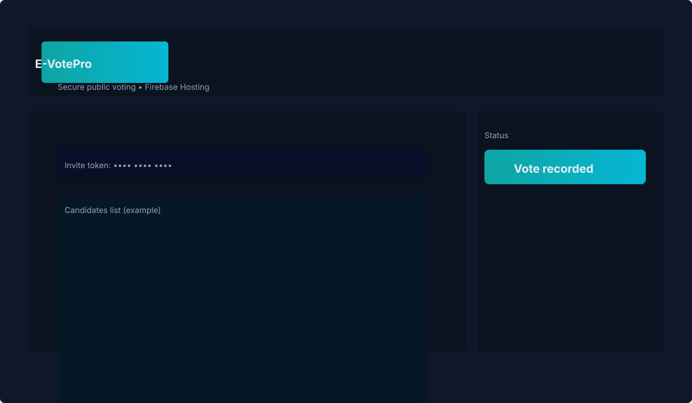

# E-VotePro

## Project Overview

E-VotePro is a secure voting platform for creator-managed elections and public voting. The current production release uses a Firebase-only architecture with a React + Vite frontend, Firebase Hosting, Firestore, and Firebase Auth.

- Secure public voting with invite-token eligibility checks
- Creator/admin dashboard for election management
- Anonymous voter auth with single-use invite enforcement
- Firestore audit logging for every accepted ballot
- Mobile-friendly voting UX for desktop and phone browsers

## Current Architecture

- React + Vite frontend
- Firebase Hosting for deployment
- Firestore as the system of record for elections, invites, voters, and audits
- Firebase Auth anonymous sign-in for public voters
- Firestore transactions for vote submission and duplicate prevention
- No legacy hosted vote route in the production vote path
- No backend vote function path in the production vote path
- No demo-mode production fallback

## Security Model

The public vote flow is designed around eligibility plus atomic persistence.

- Invite tokens are pre-generated by the creator and bound to one election
- Anonymous Firebase Auth provides the voter UID used during submission
- A valid invite token is required before the ballot can be cast
- Firestore transactions atomically consume the invite and record the ballot
- Audit log documents are written with the same logical vote submission
- Duplicate voting is blocked by the invite `used` flag and transaction checks
- Transaction guarantees prevent partial updates from producing a counted ballot without a redeemed invite

## Testing & Validation

The release candidate was validated with automated browser and emulator checks.

- Playwright E2E suite covers normal vote, mobile refresh, offline/retry, duplicate-token, invalid-token, and concurrent-session flows
- Emulator stress tests validated concurrent vote integrity
- Duplicate-prevention validation confirmed single-use invite behavior
- Offline/retry validation confirmed the UI surfaces retryable failures and succeeds after reconnect
- Validation result: 12/12 Playwright tests passing
- Emulator integrity result: invite redemption, voter records, audits, and candidate votes all matched after the passing run

## Deployment

Production deploys only through Firebase.

Required environment variables:

- `VITE_FIREBASE_API_KEY`
- `VITE_FIREBASE_AUTH_DOMAIN`
- `VITE_FIREBASE_PROJECT_ID`
- `VITE_FIREBASE_STORAGE_BUCKET`
- `VITE_FIREBASE_MESSAGING_SENDER_ID`
- `VITE_FIREBASE_APP_ID`

Useful commands:

```powershell
npm run validate:firebase
npm run build
npm run deploy:firebase
```

Local emulator mode:

```powershell
npm run emulators:start
npm run dev:emulator
```

## Operational Limits

Firebase Spark can support small-to-medium election workloads, but public voting traffic should stay well below quota ceilings. A conservative planning number is roughly 1,000 public votes per day on Spark when you include Firestore reads, writes, and dashboard/listener traffic. For higher concurrency or sustained volume, monitor quota usage closely and plan a move to a paid tier.

## Scripts

Root package scripts:

- `npm run dev` - start the Vite frontend
- `npm run dev:emulator` - start the Vite frontend in emulator mode
- `npm run validate:firebase` - validate required Firebase client env vars
- `npm run build` - validate Firebase config and build the production bundle
- `npm run smoke:firebase` - run the Firestore smoke test
- `npm run lint` - run ESLint
- `npm run preview` - preview the production build locally
- `npm run test:e2e` - run Playwright against the configured projects
- `npm run emulators:start` - start Firebase Auth and Firestore emulators
- `npm run deploy:firebase` - deploy Firebase Hosting plus Firestore rules

Backend package scripts:

- `npm --prefix backend run start` - start the legacy backend entry point
- `npm --prefix backend run test` - placeholder backend test script

## Release Status

Current status: RELEASE CANDIDATE / GO

The validated production path is Firebase-only, the public vote flow is operationally stable, and the current implementation is suitable for small-to-medium election workloads.

## GitHub

This project's source code and release tooling are hosted on GitHub. For the canonical repository URL, (https://github.com/Sharjeelbalochsp25/evote-pro).

## Screenshots

Here are example screenshots of the E-VotePro web app. These are illustrative snapshots of the public vote flow UI (desktop and mobile views).




